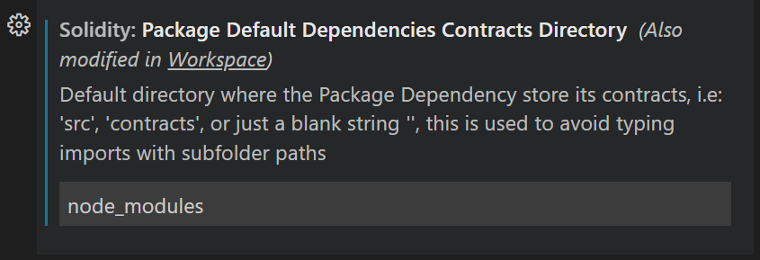
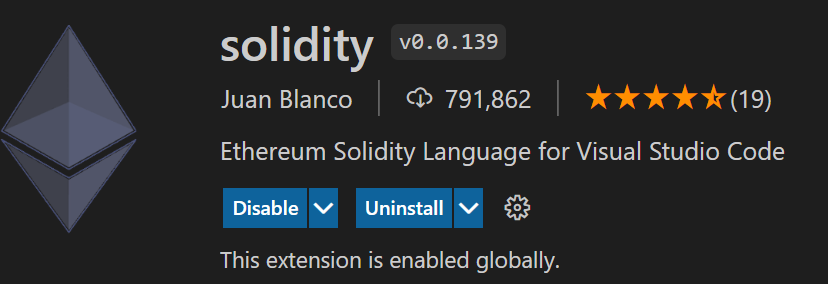
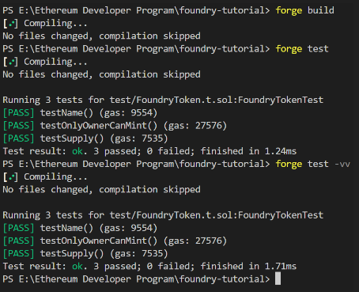
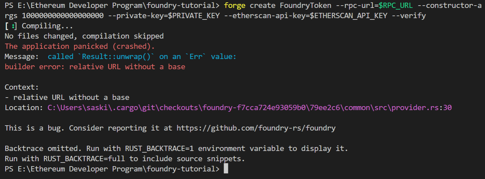

# Challenges

- [X] Testing a Smart Contract

## Configuracion en VS CODE

- Settings →

- Extension →

- en el archivo FOUNDRY.toml

[profile.default]

Comandos que hacer
`npm install @openzeppelin/contracts`

`npm i` 

`forge build`

`forge test || forge test -vv`

- [ ] Deploying a Smart Contract

Tuve el error que se muestra en la imagen, no pude resolverlo.